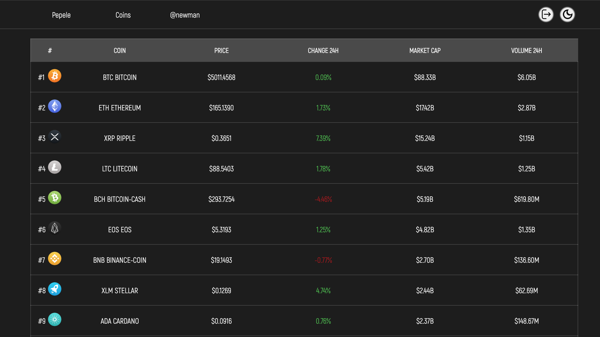
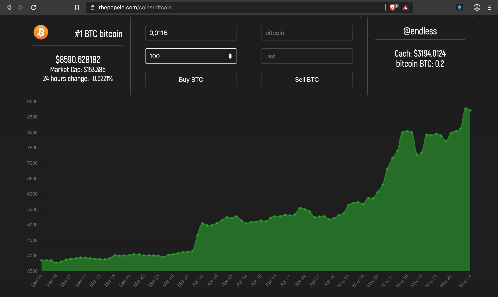
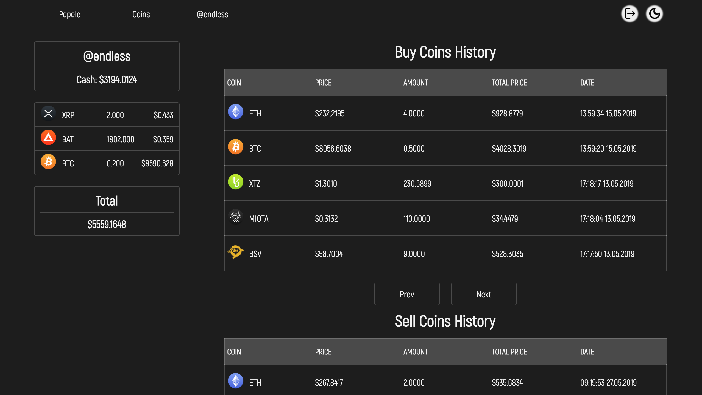

## [The Pepele](https://thepepele.com/)

### frontend part

<p align="center">
  
</p>
<p align="center">
  
</p>
<p align="center">
  
</p>

To Run the app, please run before [backend part](https://github.com/fleple/Nmisread)

```js
//install all dependecies
yarn install
//or
npm install

//to run
yarn start
//or
npm run start
```